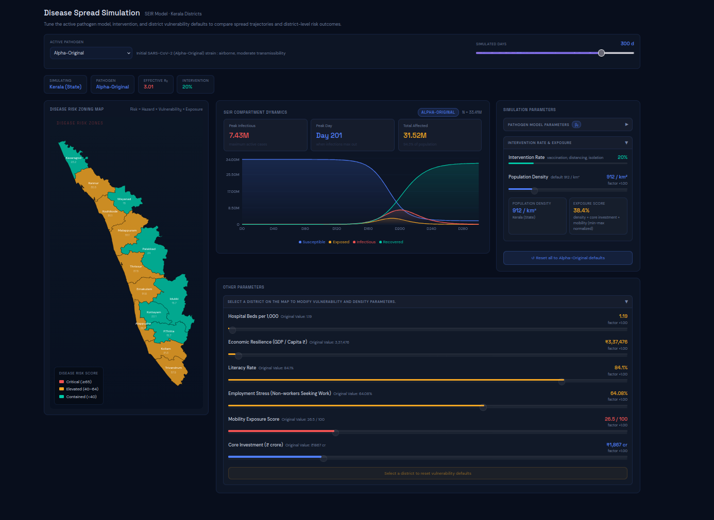

# ThreatScope: Transmittable Disease Risk Assessment

---

## 1. Problem Statement

Local and regional governments face immense challenges in anticipating, mitigating, and responding to transmittable disease outbreaks. Without clear visibility into which specific districts or regions are fundamentally more vulnerable—due to underlying sociodemographic, healthcare, or economic factors—critical resource allocation (such as hospital beds, vaccines, and economic support) is often reactive rather than proactive.

## 2. Our Solution: ThreatScope

ThreatScope is an advanced, analytical geospatial dashboard and epidemiological simulation engine. It provides public health officials and policymakers with a comprehensive, data-driven platform to:

- Assess district-wise vulnerability based on real-world census and healthcare constraints.
- Simulate the realistic spread of various disease variants (e.g., Alpha-Original, Beta, Delta) using a robust SEIR mathematical model.
- Interactively modify regional parameters (like intervention rates or hospital bed capacities) to instantly visualize theoretical outcomes and direct policy interventions.

## 3. Who is Benefitted?

- **Public Health Officials & Epidemiologists:** To monitor high-risk zones and plan resource distribution before a crisis peaks.
- **Government Administrators & Policymakers:** To model the impact of non-pharmaceutical interventions (lockdowns, distancing) before enforcing them, seeing the exact day the "curve flattens".
- **Healthcare Supply Chain Managers:** To predict where hospital and ICU bed deficits will be most acute during a specific outbreak wave.
- **Researchers & Academics:** To analyze the intricate relationship between socioeconomic vulnerability and epidemic exposure potential.

---

## 4. Platform Features & Slide-by-Slide Breakdown

### Page 1: Vulnerability Index Dashboard

This page provides a macro-level overview of regional vulnerabilities using real demographic and economic data.

- **Interactive Choropleth Map:** Visualizes key metrics (Overall Vulnerability Score, Population Density, Literacy, GDDP, and Healthcare Capacity) across district boundaries, allowing for quick, color-coded hotspot identification.
- **Exposure & Demographic Panels:** Interactive bar charts detailing Population Density, Literacy, and GDDP. It features a custom stacked bar chart illustrating exactly how the district's population splits between Rural and Urban demographics, along with absolute population figures on hover.
- **Rankings Table & Capacity Charts:** Sortable tables exposing the raw data and relative Risk Tier assigned to each district, alongside charts tracking hospital beds per 1,000 people against recommended baselines.
- **Slide-in Detail Panel:** Clicking any district opens a deep-dive panel containing a bespoke Radar Chart mapping the multidimensional socio-economic deficits of that specific area.

### Page 2: Disease Spread Simulation (SEIR Model)

This page takes the static vulnerability data and injects it into a dynamic, time-based mathematical simulation.

- **Variant-Specific Pathogen Modeling:** Simulates the localized spread of distinct disease profiles (Alpha-Original, Beta, Delta variants) utilizing their scientifically backed $R_0$ (Basic Reproduction Number), infection rates ($\beta$), and incubation periods ($\sigma$).
- **SEIR Compartment Dynamics Chart:** A dynamic, interactive Area chart tracking the Susceptible, Exposed, Infectious, and Recovered populations over a given timeframe (up to 365 days).
- **Interactive Parameter Modifications:** Users can dynamically tweak intervention rates (representing social distancing, lockdowns) using sliders to watch the simulation parameters shift in real-time.
- **Geographic Exposure Scaling:** The simulation automatically adjusts the effective transmission rate ($\beta$) based on the specific population density and baseline vulnerability of the exact district you select on the map.

---

## 5. Dashboard Screenshots

### Tool Dashboard – View 1

### Tool Dashboard – View 2

---

## 6. Risk Mapping & Risk Formula

### Risk Mapping (District Risk Tiers)

ThreatScope maps each district into a qualitative risk tier based on the computed composite vulnerability score:

- **High Risk:** score $\ge 66$
- **Moderate Risk:** $33 \le$ score $< 66$
- **Low Risk:** score $< 33$

### Risk Formula (Composite Vulnerability Score)

For each district $d$ and indicator $j$:

1. **Min-max normalization**
   $$n_{d,j} = \frac{x_{d,j} - \min(x_j)}{\max(x_j) - \min(x_j)}$$

2. **Direction adjustment**
   - If higher value means _less_ vulnerability (e.g., literacy, beds, GDDP), use:
     $$z_{d,j} = 1 - n_{d,j}$$
   - Otherwise, use:
     $$z_{d,j} = n_{d,j}$$

3. **Weighted aggregation (scaled to 0–100)**
   $$V_d = 100 \times \frac{\sum_j w_j z_{d,j}}{\sum_j w_j}$$

In the current implementation, all selected dimensions are given equal weight ($w_j = 1$), producing a balanced district-wise vulnerability index.

---

## 7. Vulnerability Score Methodology & Academic Validation

The composite vulnerability score (ranging from 0–100) is calculated by normalizing various socio-economic and healthcare indicators.
**Crucially, in our engine, we assign _equal weights_ to all dimensions (e.g., Literacy Rate, Hospital Beds, Population Density, GDDP, Employment constraints)**.

This equal-weighting methodology for normalized multidimensional epidemiological indexing is strictly validated by and inspired by the seminal RAND Corporation study:

> **"Identifying Future Disease Hot Spots: Infectious Disease Vulnerability Index"**
> _by Melinda Moore, Bill Gelfeld, Adeyemi Okunogbe, and Christopher Paul._

According to this validated framework, an infectious disease outbreak exploits systemic weaknesses holistically; a severe relative deficit in healthcare capacity is treated as just as critically vulnerable to the spread as massive population density or severe economic deprivation. The model scales each factor using a mathematically robust min-max algorithm and combines them to yield a unified, scientifically backed frailty index.

---

## 8. Technical Stack & Architecture

- **Frontend Framework:** React 18
- **Data Visualization:** Recharts, d3-geo (for SVG map projections)
- **Data Parsing:** PapaParse for client-side loading of raw CSV datasets
- **Styling Engine:** Custom CSS Custom Properties (CSS variables) utilizing dynamic dark-mode glassmorphic theming.
- **Data Architecture:** Purely CSV-driven (`public/data/`). No hardcoded demographic data; everything is loaded dynamically at runtime, making this app instantly generalizable to _any_ global region or state just by swapping the CSV files.
